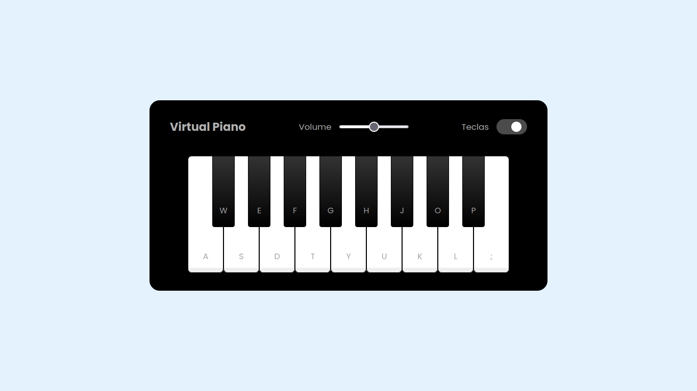

# :musical_keyboard: Simulador de piano

O projeto apresenta um simulador de piano construído apenas com HTML, CSS e JavaScript. Com ele é possível tocar 17 diferentes tons através de cliques do mouse ou das teclas do computador. Também é possível ajustar o seu volume e limitar a reprodução dos sons apenas ao uso do mouse.

Utilizando JavaScript puro, foram trabalhados conceitos como manipulação de DOM, adição e remoção dinâmica de classes, tratamento de eventos, estilização de elementos, uso de pseudoelementos e interação com áudios. Este é um desafio de projeto da Digital Innovation One.

## :gear: Tecnologias

- HTML
- CSS
- JavaScript

## :art: Layout

